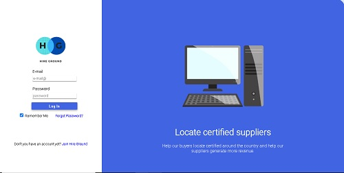
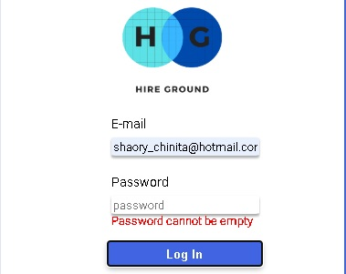
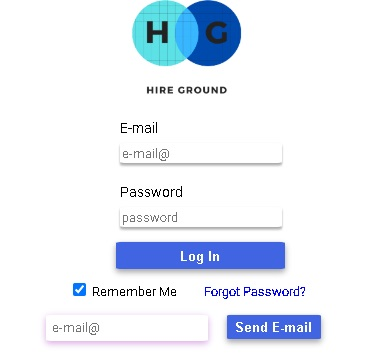
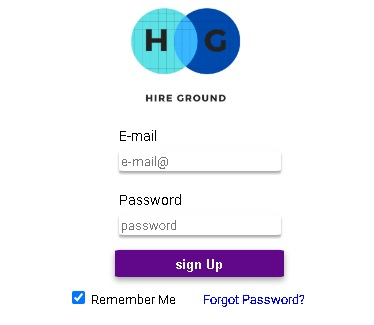

This project was bootstrapped with [Create React App](https://github.com/facebook/create-react-app), & [Firebase](https://firebase.google.com/)

## Índice

* [1. Project Description](#PROJECT-DESCRIPTIONS)
* [2. Log In](#Log-In)
* [3. Forgot Password?](#Forgot-Password?)
* [4. Don't you have an Account yet?](#Don't-you-have-an-Account-yet?)
* [4. Main Screen](#Main-Screen)
* [4. Technologies](#Technologies)
* [4. Deployment](#Deployment)

## PROJECT DESCRIPTION:

This project is a login view in which the user can interact with the fields to enter the main screen. It also has a link where you need to enter your email address to change your password. And in case the user is not registered, he can register with his email and password.

### Log In

To enter the main screen, the user must enter their email and password, the fields are validated so that the fields are not sent empty, with an 'invalid' email or a very short password. In case the user is not registered in the database, the form will not be sent and you will not be able to access the main screen.

### Forgot password?

The link "forgot password" is located just below the space for the password, when you press on the text automatically a field opens to enter the email of the account you want to recover the password and when you press the "send" button it will automatically send an email to your account registered in the database.

### Don't you have an Account yet?

The link for 'Don't you have an account yet?' allows the user to register with their email and a password. When pressing the text, the "Log in" button changes to the 'Sign up' button. Pressing the button sends the form, creates an account and automatically accesses the main screen.

### Main Screen

On the main screen, a "log Out" button was added, because the function you use for the logIn is a function that reminds the logged-in user even though the page refreshes. So to exit the main screen the user needs to press the "log Out" button

## Technologies

some of the technologies that were used to create this project were:

To create this project: [Create React App documentation](https://facebook.github.io/create-react-app/docs/getting-started).

To Data management, like register and log In sesion or change the password: [Firebase](https://firebase.google.com/).

To versions management: [Git](https://git-scm.com/), & [GitHub](https://github.com/).

And [NodeJs] (https://nodejs.org/es/) for the management of the locallHost & [NPM] (https://www.npmjs.com/) to package managements

### Deployment

You can see this project on: https://sahory31.github.io/LogInChallenge/
